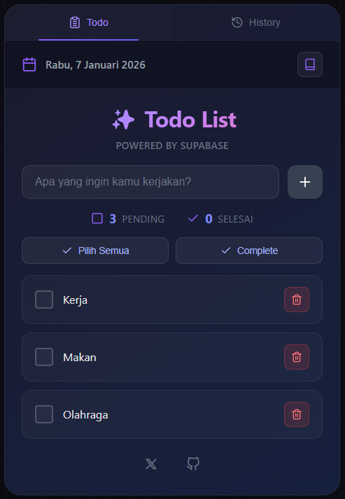

# Todo PWA

Aplikasi Todo List modern dengan fitur PWA (Progressive Web App), dark theme, dan penyimpanan cloud menggunakan Supabase.



## Fitur

- ✅ Tambah, edit, dan hapus todo
- ✅ Checklist todo selesai/belum
- ✅ Pilih semua / batalkan semua
- ✅ Complete Day - selesaikan hari ini dan mulai task besok tanpa tunggu pergantian hari
- ✅ Reset otomatis setiap ganti hari (00:00 WIB)
- ✅ History todo per tanggal (timezone WIB)
- ✅ Password protection
- ✅ Dark theme modern
- ✅ Responsive (mobile friendly)
- ✅ PWA (bisa di-install)
- ✅ Data tersimpan di cloud (Supabase)

## Tech Stack

- React 19
- Vite
- CSS Modules
- Supabase
- PWA (vite-plugin-pwa)

## Instalasi

### 1. Clone repository

```bash
git clone https://github.com/amarudinn/todolist.git
cd todolist
```

### 2. Install dependencies

```bash
npm install
```

### 3. Setup Supabase

1. Buat project di [supabase.com](https://supabase.com)
2. Buka SQL Editor dan jalankan query dari file `supabase-schema.sql`
3. **PENTING:** Jika table `todos` sudah ada sebelumnya, jalankan juga migration dari file `supabase-migration-add-date.sql` untuk menambah kolom `date`
4. Copy URL dan anon key dari Settings > API

### 4. Setup Environment Variables

Buat file `.env` di root project:

```env
VITE_SUPABASE_URL=https://xxxxx.supabase.co
VITE_SUPABASE_ANON_KEY=eyJhbGciOiJIUzI1NiIsInR5cCI6...
VITE_APP_PASSWORD=password_rahasia_kamu
```

### 5. Jalankan development server

```bash
npm run dev
```

Buka http://localhost:5173

## Deploy ke Vercel

1. Push ke GitHub
2. Import project di [vercel.com](https://vercel.com)
3. Tambahkan Environment Variables:
   - `VITE_SUPABASE_URL`
   - `VITE_SUPABASE_ANON_KEY`
   - `VITE_APP_PASSWORD`
4. Deploy

## License

MIT
